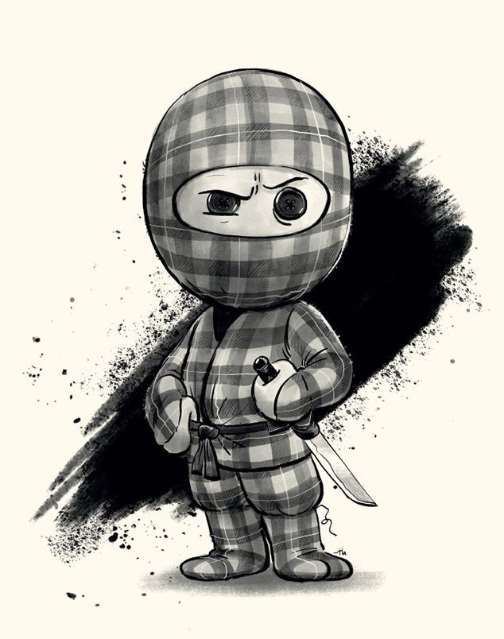

# Zip Ninja
> Script splits fat archive into several parts 
> also combines several parts back to fat



## Requirements
* pv

## Usage
1. Install requirements 
```brew install pv```
2. Run ```python zip-ninja.py```
3. Drop zip file(-s) in terminal window
4. Press _Enter_